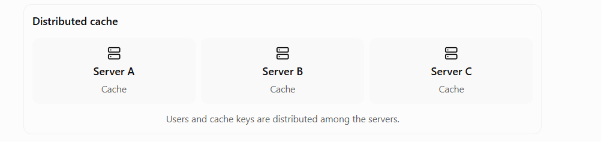
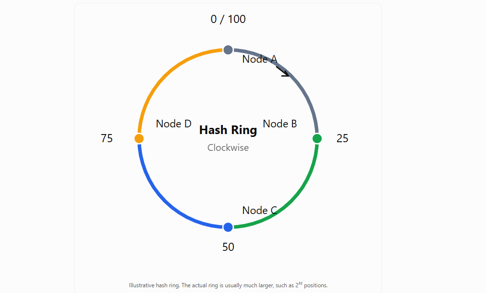
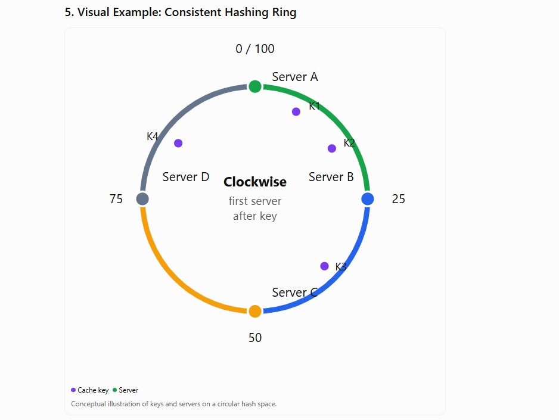
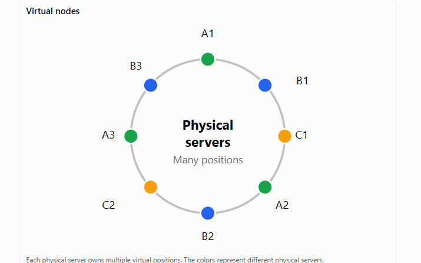
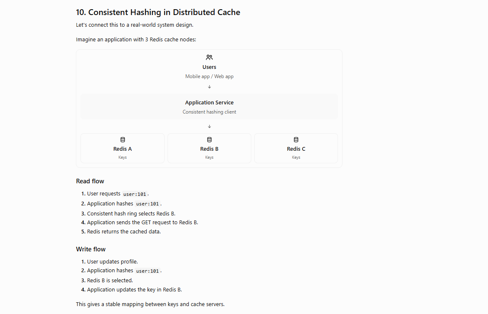

# Consistent Hashing

Consistent Hashing is a hashing technique used in distributed systems to distribute data across multiple servers while minimizing data movement when servers are added or removed.

It is commonly used in:

- Distributed caches like Redis clusters and Memcached.
- Database sharding.
- Distributed storage systems.
- Load balancing.
- Service routing.

Let's understand it from scratch with a real-time example.

---

## 1. Why do we need Consistent Hashing?

Imagine you are designing a distributed cache for an e-commerce application.

You have 3 cache servers:



**Distributed cache**

- Server A — Cache
- Server B — Cache
- Server C — Cache

Users and cache keys are distributed among the servers.

You need to decide:

> Which cache server should store a particular key?

For example:

```
user:101
user:102
user:103
user:104
```

A common solution is simple hashing.

---

## 2. Traditional Hashing (Modulo Hashing)

The simplest approach is:

```
serverIndex = hash(key) % numberOfServers;
```

Example:

```java
int serverIndex = Math.abs(key.hashCode()) % 3;
```

Assume the hash values are:

| Key | Hash value | Hash % 3 | Server |
|---|---|---|---|
| user:101 | 10 | 1 | Server B |
| user:102 | 20 | 2 | Server C |
| user:103 | 30 | 0 | Server A |
| user:104 | 40 | 1 | Server B |

### Problem: A new server is added

Now you add Server D.

```
serverIndex = hash(key) % 4;
```

| Key | Hash value | Old % 3 | New % 4 |
|---|---|---|---|
| user:101 | 10 | B | C |
| user:102 | 20 | C | A |
| user:103 | 30 | A | C |
| user:104 | 40 | B | A |

Almost all keys may map to different servers.

### What happens in a distributed cache?

- Existing cache entries are no longer found at their expected servers.
- Cache hit rate drops.
- Many requests go to the database.
- Database load increases.
- Latency increases.

This is called **massive key remapping**.

Consistent Hashing solves this problem by reducing how many keys need to move.

---

## 3. What is Consistent Hashing?

Consistent Hashing maps both:

- Cache keys.
- Servers (nodes).

onto the same logical hash space, often represented as a ring.

Instead of using:

```
hash(key) % numberOfServers
```

we use:

```
hash(key) → position on a ring
```

Each key is assigned to the next server when moving clockwise around the ring.

### Main idea

> When a server is added or removed, only a limited portion of keys need to move, rather than remapping every key.

---

## 4. How Consistent Hashing Works Internally

### Step 1: Create a hash ring

Imagine a hash space from `0` to `99` arranged in a circle.



> Illustrative hash ring. The actual ring is usually much larger, such as 2³² positions.

The hash function maps values into the ring.

For example:

```
hash("Server A") = 10
hash("Server B") = 40
hash("Server C") = 70
```

The servers are placed at positions:

```
Server A → 10
Server B → 40
Server C → 70
```

The ring wraps around from `99` back to `0`.

### Step 2: Hash the cache keys

Now hash the keys:

```
hash("user:101") = 15
hash("user:102") = 45
hash("user:103") = 80
hash("user:104") = 90
```

### Step 3: Find the next server clockwise

Each key is assigned to the first server encountered clockwise.

| Key | Hash position | Next server clockwise |
|---|---|---|
| user:101 | 15 | Server B (40) |
| user:102 | 45 | Server C (70) |
| user:103 | 80 | Server A (10, after wrap) |
| user:104 | 90 | Server A (10, after wrap) |

The assignment rule is:

```
key position → move clockwise → first server found
```

---

## 5. Visual Example: Consistent Hashing Ring



- **Cache key**
- **Server**

> Conceptual illustration of keys and servers on a circular hash space.

---

## 6. What happens when a new server is added?

Suppose we have:

```
Server A → 10
Server B → 40
Server C → 70
```

Now add:

```
Server D → 50
```

Before adding D:

```
10 (A) → 40 (B) → 70 (C) → wrap
```

After adding D:

```
10 (A) → 40 (B) → 50 (D) → 70 (C) → wrap
```

### Key movement

Keys between Server B and Server D now belong to D.

For example:

| Key | Position | Before | After |
|---|---|---|---|
| user:101 | 15 | B | B |
| user:102 | 45 | C | D |
| user:103 | 80 | A | A |
| user:104 | 90 | A | A |

Only keys in the affected interval move.

In this simplified example, `user:102` moves from C to D. Other keys remain on the same servers.

### Why this is better

With modulo hashing:

```
Add 1 server → many keys remapped
```

With consistent hashing:

```
Add 1 server → only keys in the new server's interval move
```

The precise number depends on the distribution of servers and keys.

---

## 7. What happens when a server is removed?

Suppose Server B fails.

Before:

```
A → B → C
```

The keys that were assigned to B move to the next server clockwise, which is C.

After:

```
A → C
```

Example:

| Key | Before | After B removed |
|---|---|---|
| user:101 | B | C |
| user:102 | C | C |
| user:103 | A | A |
| user:104 | A | A |

Only the keys owned by the removed server need to be reassigned.

> **Important:** Consistent hashing does not automatically copy the data to the new server. It determines where keys should map. Data movement, replication, and cache warm-up are separate responsibilities.

---

## 8. Virtual Nodes (VNodes)

This is one of the most important interview concepts.

### Problem with only one position per server

Suppose:

```
Server A → position 10
Server B → position 40
Server C → position 70
```

What if the hash positions are uneven?

```
Server A → 5
Server B → 6
Server C → 95
```

Server C may own a very large portion of the ring.

This causes:

- Uneven data distribution.
- Uneven request load.
- Hotspots.
- Poor cache utilization.

### Solution: Virtual Nodes

Instead of mapping one server to one position, map each physical server to multiple virtual positions.

Example:

```
Server A:
  A1 → 10
  A2 → 35
  A3 → 80

Server B:
  B1 → 20
  B2 → 50
  B3 → 90

Server C:
  C1 → 30
  C2 → 60
  C3 → 95
```

The hash ring now has many positions.

**Virtual nodes**



> Each physical server owns multiple virtual positions. The colors represent different physical servers.

### Benefits of Virtual Nodes

- Better load distribution.
- More uniform key ownership.
- Less data movement when nodes are added or removed.
- Easier scaling.
- Can support servers with different capacities using different vnode counts or weights.

For example:

```
Server A → 100 virtual nodes
Server B → 100 virtual nodes
Server C → 200 virtual nodes
```

Server C has roughly twice the capacity, so it can own more of the hash space.

---

## 9. Java Implementation

Let's implement a basic consistent hash ring using Java's `TreeMap`.

`TreeMap` is useful because it keeps server positions sorted and supports finding the first server at or after a key's hash.

### Example

```java
import java.util.Map;
import java.util.TreeMap;

public class ConsistentHashing {

    private final TreeMap<Integer, String> ring
            = new TreeMap<>();

    private final int numberOfVirtualNodes = 3;

    public void addServer(String server) {

        for (int i = 0; i < numberOfVirtualNodes; i++) {

            int hash = hash(server + "#" + i);

            ring.put(hash, server);
        }
    }

    public void removeServer(String server) {

        for (int i = 0; i < numberOfVirtualNodes; i++) {

            int hash = hash(server + "#" + i);

            ring.remove(hash);
        }
    }

    public String getServer(String key) {

        if (ring.isEmpty()) {
            return null;
        }

        int hash = hash(key);

        Map.Entry<Integer, String> entry =
                ring.ceilingEntry(hash);

        if (entry == null) {

            // Wrap around to the first server
            entry = ring.firstEntry();
        }

        return entry.getValue();
    }

    private int hash(String key) {

        return Math.abs(key.hashCode());
    }

    public static void main(String[] args) {

        ConsistentHashing ch = new ConsistentHashing();

        ch.addServer("Server-A");
        ch.addServer("Server-B");
        ch.addServer("Server-C");

        System.out.println(
                "user:101 -> " + ch.getServer("user:101")
        );

        System.out.println(
                "user:102 -> " + ch.getServer("user:102")
        );

        System.out.println(
                "user:103 -> " + ch.getServer("user:103")
        );

        ch.addServer("Server-D");

        System.out.println(
                "After adding Server-D:"
        );

        System.out.println(
                "user:101 -> " + ch.getServer("user:101")
        );
    }
}
```

### How the Java code works

**1. Hash the server**

`hash(server + "#" + i)` creates positions for virtual nodes.

**2. Find the next position**

`ceilingEntry(hash)` finds the first ring position greater than or equal to the key's hash.

**3. Wrap around**

If no position exists after the key, use `firstEntry()`.

### Complexity

Let:

- `N` = number of virtual nodes in the ring.
- `S` = number of physical servers.
- `V` = virtual nodes per server.

| Operation | Time complexity |
|---|---|
| Add server | O(V log N) |
| Remove server | O(V log N) |
| Find server | O(log N) |
| Space | O(N) |

With virtual nodes:

```
N = S × V
```

---

## 10. Consistent Hashing in Distributed Cache

Let's connect this to a real-world system design.

Imagine an application with 3 Redis cache nodes:



- **Users** — Mobile app / Web app
- **Application Service** — Consistent hashing client
- **Redis A** — Keys
- **Redis B** — Keys
- **Redis C** — Keys

### Read flow

1. User requests `user:101`.
2. Application hashes `user:101`.
3. Consistent hash ring selects Redis B.
4. Application sends the `GET` request to Redis B.
5. Redis returns the cached data.

### Write flow

1. User updates profile.
2. Application hashes `user:101`.
3. Redis B is selected.
4. Application updates the key in Redis B.

This gives a stable mapping between keys and cache servers.

---

## 11. Consistent Hashing vs Rendezvous Hashing

Both are used for distributing keys across servers.

| Feature | Consistent Hashing | Rendezvous Hashing |
|---|---|---|
| Main idea | Ring + clockwise successor | Choose server with highest score |
| Data structure | Hash ring | Servers and scores |
| Virtual nodes | Commonly used | Usually not required |
| Lookup | O(log N) with a sorted ring | O(S) basic implementation |
| Server changes | Limited key movement | Limited key movement |
| Common use | Distributed caches, routing | Distributed caches, load balancing |

Rendezvous hashing is also called **Highest Random Weight (HRW) hashing**.

---

## 12. Important Interview Questions

1. Why is Consistent Hashing better than modulo hashing?
2. What is a hash ring?
3. What are virtual nodes?
4. What happens when a server fails?
   - Keys assigned to the failed server are routed to the next available server clockwise. Data replication or recovery must be handled separately.
5. What is the complexity of lookup?
6. Does consistent hashing guarantee perfect load balancing?
7. Is Redis Cluster the same as a traditional consistent hash ring?

---

## 13. Key Takeaways

- Consistent Hashing distributes keys across servers using a logical hash ring.
- It avoids remapping most keys when servers are added or removed.
- Virtual nodes improve load distribution.
- `TreeMap.ceilingEntry()` is a simple way to implement ring lookup in Java.
- It is useful for distributed caches, sharding, and scalable routing.
- It does not automatically provide replication, data migration, or fault tolerance.

### One-line interview answer

> Consistent Hashing is a distributed hashing technique that maps both servers and keys onto a circular hash ring, assigning each key to the next server clockwise. It minimizes key remapping when servers are added or removed, making it useful for distributed caches and sharded systems.

---

## Q & A

**1. Why is Consistent Hashing better than modulo hashing?**

Modulo hashing can remap most keys when the number of servers changes. Consistent hashing limits movement to keys in affected ring intervals.

**2. What is a hash ring?**

A logical circular hash space. Both server positions and key positions are mapped onto it, and each key is assigned to the next server clockwise.

**3. What are virtual nodes?**

Multiple hash positions representing one physical server. They improve distribution and reduce the impact of uneven server placement.

**4. What happens when a server fails?**

Keys assigned to the failed server are routed to the next available server clockwise. Data replication or recovery must be handled separately.

**5. What is the complexity of lookup?**

With a sorted `TreeMap` ring, lookup is O(log N), where N is the number of virtual-node positions.

**6. Does consistent hashing guarantee perfect load balancing?**

No. It improves distribution, especially with virtual nodes, but hot keys, uneven capacity, and poor hash functions can still create imbalance.

**7. Is Redis Cluster the same as a traditional consistent hash ring?**

No. Redis Cluster uses a fixed set of 16,384 hash slots and assigns slots to nodes. It is a related key-distribution approach, but not the classic ring implementation.

