# How Kafka Works

## What is Kafka? How to use Confluent Kafka in Spring Boot Application

**Open Source Distributed Event Streaming Platform**

- **Distributed** means it can run on multiple servers to handle large amount of data.
- **Event streaming platform** means data streaming platform.

Kafka is designed to handle data that is constantly being generated and needs to be processed as it comes in, without delays.

Whenever or wherever data is generating constantly and we need to process also, so we will use Kafka.

---

## Example

There is a social media platform where peoples are giving like, comments and sending posts continuously. So what are all these actions? These actions are events constantly generating events. Then what KAFKA will do is he will collects all these events, stored it temporarily and then distribute it among multiple services — the services either they want to analyze the data, or the services which want to show in the fields, or the services which want to send notifications.

So like, comments and posts are like a constantly generating events. So first Kafka will collect those events and then store it temporarily and then distribute it among multiple services.

---

## What Kafka Ensures?

Kafka ensures the flow of data from source to destination should be smooth and quick.

Here Source is: People are posting, liking and commenting. Destination is: data should update in fields or notifications should come.

---

## Without Kafka, What Would Be the Problem?

Suppose users are doing like, posting stories and doing comments on posts. So when the user does like or he posts any story then there will be a direct communication with multiple services. So as soon as we comment or like immediately we have to give data to a notification service or the services which is analyzing it. So we have a Like Service and a Notification Service — so through API we have a direct communication with both. So there is no use, simply continuously API services are hitting so simply we are putting load on services.

- Suppose email/notification service got down and simply we are doing likes so data will be lost and notifications won't come.
- Or suppose many more users came and they started using your application and everyone are giving like and posting stories so continuously services are getting hit, so in this case more load will come to notification service.
- So we will put Kafka in between the producer/like service and the consumer/notification service.
- So Like Service will give data to Kafka and from Kafka Notification Service will collect the data.

> \*\* Direct API call often a Synchronous call, which means Like Service sent a data to Notification Service and keeps waiting for a response.

> \*\* But In Kafka we can Achieve Asynchronicity

Suppose 1 million per second we are giving likes then 1 million/sec calls are going to notification service. Suppose we are putting Kafka in between then 1 million calls will go to Kafka but the data which we have given to Kafka will break across multiple servers and data will consumed parallelly.

- So here we are achieving **scalability**.
- We are achieving **fault tolerance**.
- We are achieving **asynchronicity**.
- Our system is **decoupled**.

So these all are the Benefits of Kafka. We are not going to run Kafka locally. We will integrate Kafka cloud with our Spring Boot application.

---

## Basic Kafka Terminologies

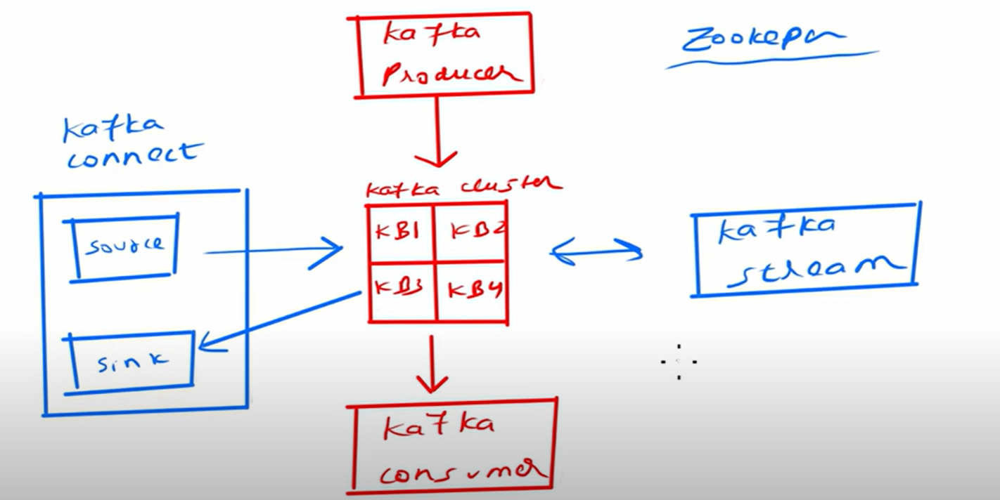

### 1. Kafka Cluster
Group of Kafka Brokers. A multiple servers/brokers where our Kafka will be running.

### 2. Kafka Broker
A server on which Kafka will be Running.

### 3. Kafka Producer
Write new data into the Kafka Cluster.

### 4. Kafka Consumer
Pick/Read data from the Kafka Cluster.

### 5. Zookeeper
Keeps a Track of Kafka Cluster Health. It monitors kafka cluster health.

### 6. Kafka Connect
If you want to bring data from External entity into Kafka Cluster then you can use Kafka Connect without writing a single line of code. This is called **declarative integration**, because we are just declaring from which server data will come and into which server data will come. Either you want to bring data from database or file or any external source.

In Kafka Connect, from Source data will come into Kafka Cluster, and if we want to fetch then using Kafka Connect data will be fetched from Kafka Cluster into Sink.

If you want data movement in/out from Kafka Cluster then we will use Kafka Connect.

### 7. Kafka Stream
There will be some functionalities which we use for a data transformation, which means we will take some data from Kafka Cluster, we will do some transformation and then again we will put into Kafka Cluster.


---

## Installing Kafka and Zookeeper

Download binary `kafka.gz` file, extract it, and keep kafka folder in C drive.

- In Kafka folder `bin/windows/` — `***.sh` files we use to start producer/consumer/zookeeper/broker.
- In Kafka `config` folder — `server.properties` file.

```
zookeeper-server-start.bat ..\..\config\zookeeper.properties
```

### INSTALLATION COMMANDS

```
zookeeper-server-start.bat ..\..\config\zookeeper.properties

kafka-server-start.bat ..\..\config\server.properties

kafka-topics.bat --create --topic my-topic --bootstrap-server localhost:9092 --replication-factor 1 --partitions 3

kafka-console-producer.bat --broker-list localhost:9092 --topic my-topic

kafka-console-consumer.bat --bootstrap-server localhost:9092 --topic my-topic --from-beginning
```

### 🟢 SENDING MESSAGES COMMANDS

```
zookeeper-server-start.bat ..\..\config\zookeeper.properties

kafka-server-start.bat ..\..\config\server.properties

kafka-topics.bat --create --topic foods --bootstrap-server localhost:9092 --replication-factor 1 --partitions 4

kafka-console-producer.bat --broker-list localhost:9092 --topic foods --property "key.separator=-" --property "parse.key=true"

kafka-console-consumer.bat --bootstrap-server localhost:9092 --topic foods --from-beginning -property "key.separator=-" --property "print.key=false"
```

---

## Exercise

### Command - 1

```
C:\kafka_2.13-3.9.1\bin\windows>zookeeper-server-start.bat ..\..\config\zookeeper.properties
```

Start `zookeeper-server.bat` file and we are providing zookeeper config properties which is in config folder. Our zookeeper started on port **2181**.

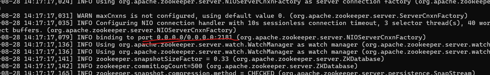

### Command - 2

```
C:\kafka_2.13-3.9.1\bin\windows>kafka-server-start.bat ..\..\config\server.properties
```

Start `kafka-server-start.bat` file and we are providing server config properties which is in config folder. It will start the Kafka broker.

Now our Kafka broker gets registered in a zookeeper. What zookeeper will do is it will monitored the health of a Kafka broker. Now Kafka server and zookeeper both got started.

Now our zookeeper and Kafka broker/server both has been started so I will now start message producing and consuming.

### Command - 3 (create a Topic)

```
C:\kafka_2.13-3.9.1\bin\windows>kafka-topics.bat --create --topic my-topic --bootstrap-server localhost:9092 --replication-factor 1 --partitions 3
```

Create a topic name `my-topic`. And their bootstrap server details has given — bootstrap server means Kafka server running on port 9092. After executing command I can see created topic `my-topic`. Topic is just like a table where we store similar kind of data. If you want to store Student data then you have to create another topic which will store students data only. If you are creating a foods topic then only foods data will be stored.

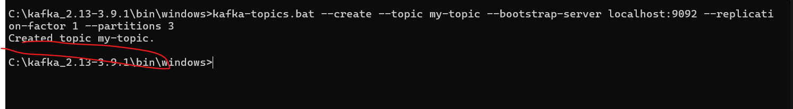

### Command - 4 (start producer | write message on a Topic)

```
C:\kafka_2.13-3.9.1\bin\windows>kafka-console-producer.bat --broker-list localhost:9092 --topic my-topic
```

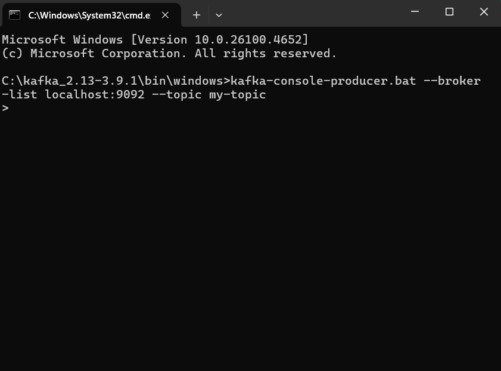

### Command - 5 (start consumer | read message from a Topic)

```
C:\kafka_2.13-3.9.1\bin\windows>kafka-console-consumer.bat --bootstrap-server localhost:9092 --topic my-topic --from-beginning
```

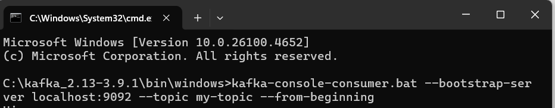

### Producer-Consumer Communication

When Kafka producer sends data to Kafka broker, actually data will go to the Kafka topic only.

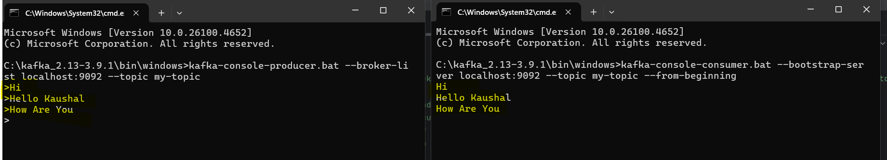

---

## Kafka Topic and Partition

### Kafka Topic

- Named Container for similar events. Unique Identifier of a topic is its name.
- We can assume Topic is like a table — how similar type of data store in a table, so similarly topic also stored similar kind of data.
- For Example, Student Topic will have Student related data & Food Topic will have food related data.
- They are like tables in a database.
- They live inside a broker.
- Producer produces a message into the topic (ultimately to partitions in round-robin fashion) or directly to the partitions. Consumer polls continuously for new messages using the topic name.
- So, a Topic is like a Table where similar kind of data will be stored. So Producer will produce data into the Topic and ultimately data will go to the Partitions.

### Kafka Partition

- A Topic is Partitioned and distributed to Kafka brokers in round-robin fashion to achieve distributed system.
- A Topic is split into several parts which are known as the partitions of the Topic.
- Partitions is where actually the message is located inside the topic.
- Producer produce on topic -> Inside Topic there is a partitions -> data will finally store into the partitions.
- Therefore while creating a topic, we need to specify the number of partitions (the number is arbitrary and can be changed later).
- Each partition is an ordered, immutable sequence of records.
- Each partition is independent of each other.
- Each message gets stored into partitions with an incremental id known as its **offset value**.
- Ordering is there only at partition level (so if data is to be stored in order then do it on same partition).
- So, if data is to be stored in order then do it on same partition.
- Partition continuously grows (offset increases) as new records are produced.
- All the records/logs exist in distributed log file.

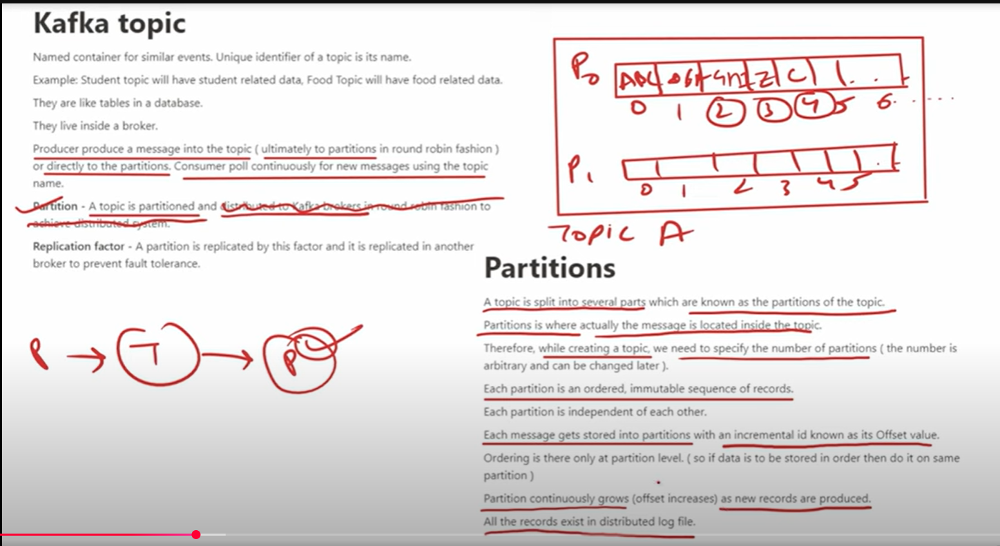

> \*\*\* **Ordering Happens at Partition Level.**

---

## Sending Kafka Message from Command Line


Suppose I am sending message to a Kafka Broker. So it will go to the Topic. Inside Topic it will go to the Partition. Now there will be more partitions like P1 and P2.

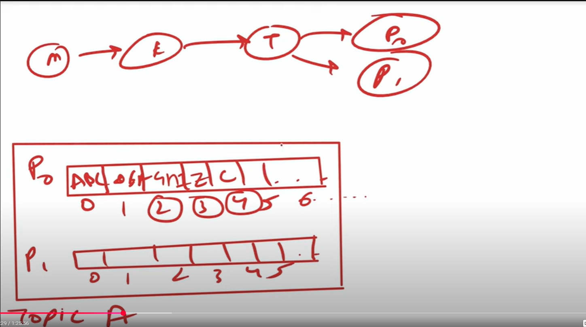

### There are 2 ways to sending a Message: With Key and Without Key

Partitioner will see the data is coming — where key presents or not. If keys not present, then it will store data in a round-robin fashion. But if key present then it will generate a hash and see in which partition data should be stored/saved.

### Sending a Message Without-Key

While we are sending a message, either we can send with a Key or without a Key. Earlier we were sending messages without Key so data were not coming in orders.

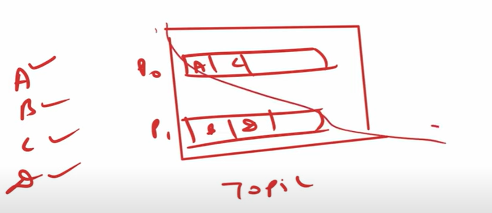

- When we send a message without Key then inside a Partition data will go in a **Round-Robin fashion**.
- Suppose we have a Topic and inside it we have 2 partitions P0 and P1. Suppose we publish A will go in partition P0, then we send B will go to partition P1, then we send C will go to partition P0, then we send D will go to partition P1. So data is going in a round-robin fashion in a partitions.
- While we run consumer, in same way randomly data will polls from the partitions which means not maintaining an order.

Suppose if we want to store in an order then keep all data in a single or in a same partition. Why are we distributing in a multiple partitions? Because ordering will happen only at a partition level.

So just note down till now we were sending message without key only.

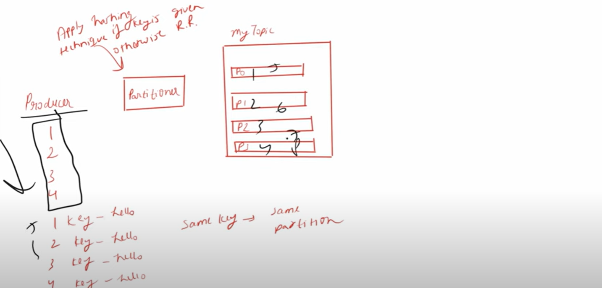

Suppose we have a topic name `MyTopic` and in that topic we have created 4 partitions p0, p1, p2 and p3. We know we can create partitions during creation of a Topic. So while producer producing data, see here we are not giving any keys. So when we run producer then without key we will produce it. So data will go in a round-robin fashion:

```
p1 - 1, 5..
p2 - 2, 6..
p3 - 3, 7..
p4 - 4, 8..
```

- If we want in an order then we want all data should go in any of one partition, because ordering happens at a partition level.
- If data came without key then it proceeds in a round-robin fashion.

### Sending a Message With-Key

Suppose if we want to store in an order then keep all data in a single or in a same partition. Why are we distributing in a multiple partitions? Because ordering will happen only at a partition level.

So just note down till now we were sending message without key only.

Suppose if we are sending a data with a key, then partitioner will come into the picture.

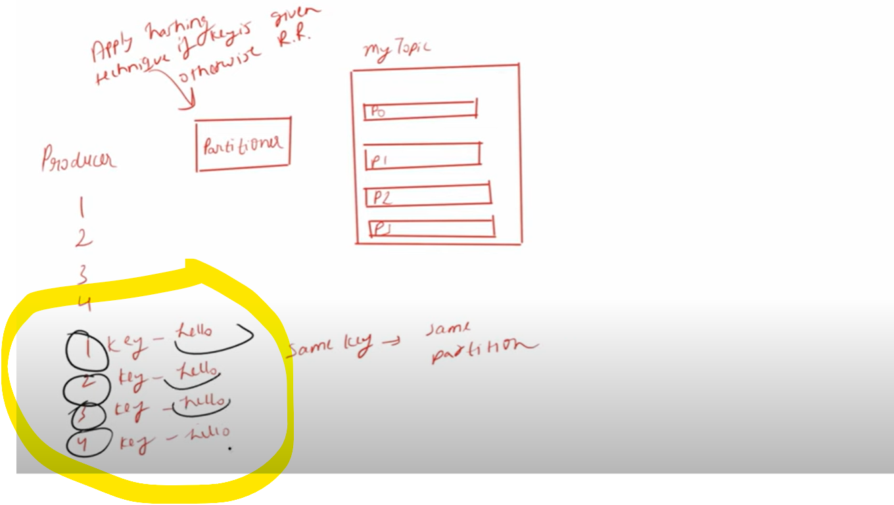

- Suppose if we are sending a data with a key, then partitioner will come into the picture.
- What Partitioner will do is it will check if there is any key present in a message. Then partitioner will apply a hashing along with data and see in which partition data will go.
- **If same Key then data will go into a same partition.**
- We have data 1, 2, 3, 4.. and all 4 data key's is `'hello'` which means out of these 4 data will go in any of one partition and saved.
- Partitioner will see the data is coming — where key presents or not. If keys not present then it will store data in a round-robin fashion. But if key present then it will generate a hash and see in which partition data should be stored/saved.

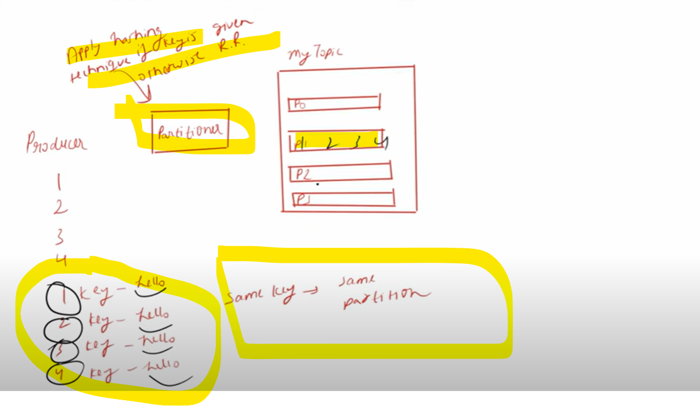

- Suppose I have produced data 5 with key `'bye'`. Suppose data 1, 2, 3, 4 stored in partition p0, and we know hash value anything can come and can select any of the partition. So corresponding to `hello` partition-p0 came, then obviously corresponding to `bye` p0 will not come — so it will come from p1, p2, p3... Suppose it came p3.
- When we will get the data 1, 2, 3 and 4 will come in order because it is coming from the same partition.

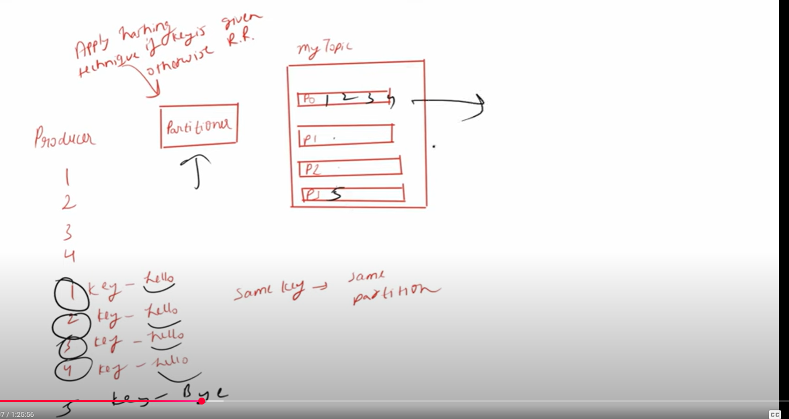

---

## Important 2 Points to Remember

1. When we send a Message there will be 2 things Key and Value, where **Key is Optional**.
2. We can send with Key and Without Key.
3. When sending messages with key, ordering will be maintained as they will be in the same partition.
4. Without Key we can not guarantee the ordering of message as consumer poll the messages from all the partitions at the same time.
5. If you want ordering guarantee then you must have to send a data with a key. So if same key then partitioner will find same hash value, so data will store in a same partition, so ordering will be matter.


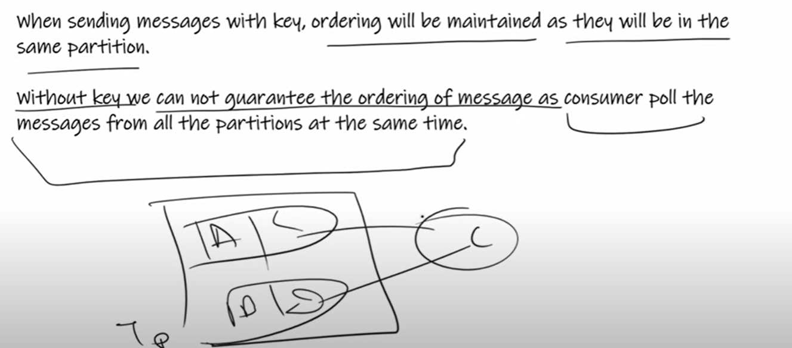

---

## Demonstration (Kafka Message with Key & Without Key)

### 1. Start Zookeeper

```
zookeeper-server-start.bat ..\..\config\zookeeper.properties
```

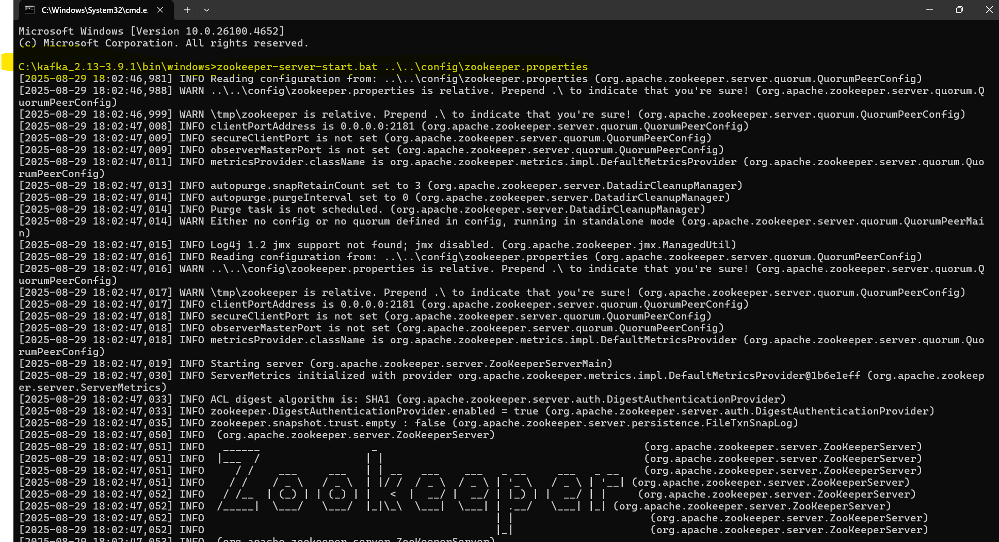

### 2. Run Kafka Broker

```
kafka-server-start.bat ..\..\config\server.properties
```

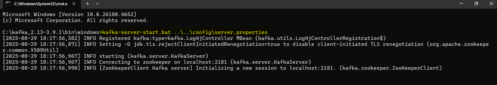

### 3. Create a new topic name - fruits

```
kafka-topics.bat --create --topic fruits --bootstrap-server localhost:9092 --replication-factor 1 --partitions 4
```

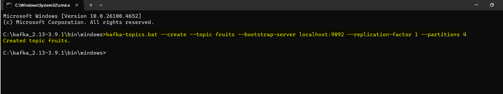

### 4. Create Producer

```
kafka-console-producer.bat --broker-list localhost:9092 --topic fruits --property "key.separator=-" --property "parse.key=true"
```

`key.separator=-`, which means I will send key and message together with a `-` symbol.

```
hello-apple
hello-kiwi
hello-banana
bye-mango
bye-guava
```

Where `hello` is a key and `apple`, `kiwi`, `banana` is a message.

So here `hello` key's data will go in a single partition and `bye` key data will go in a different partition.

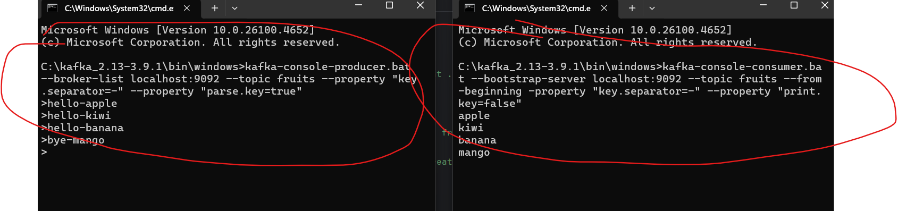

Since we are giving keys here so it will be printed in an ordered manner.

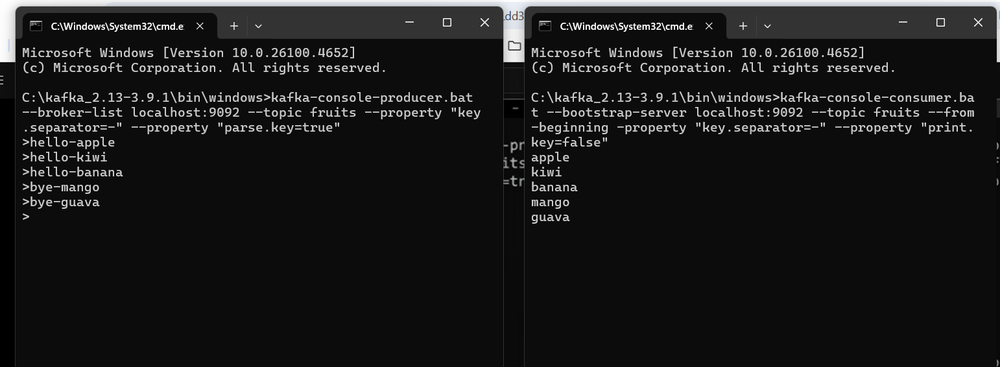

- So apple, kiwi, banana is coming from a single partition so it will be in an order bcz having same `hello` key.
- So mango, guava is coming from a single partition so it will be in an order bcz having same `bye` key.
- So we can see these all are in ordered.

### 5. Create Consumer

```
kafka-console-consumer.bat --bootstrap-server localhost:9092 --topic fruits --from-beginning -property "key.separator=-" --property "print.key=false"
```


> \*\* Earlier we saw they were not printing in order because we were not using keys there.
> \*\* If we want data in an ordered fashion then I will send data with key. If I do not want in an ordered way then I will send without key.
> \*\* Without key data will be stored in a round-robin fashion in a single Topic inside a multiple partitions.
> \*\* With key store data in same partition, without key in different partitions randomly in round-robin fashion.
> \*\* When consumer will consume then it will be in a random fashion in case we not use key with data.

---

## Consumer Offset & Consumer Groups

Now we saw how consumer is going to read the data. Suppose we have a TOPIC inside it there is 2 partitions. Suppose this consumer is reading data from this partition, then how it's going to read we will see here.

### Consumer Offset

- **Consumer offset** means Position of a Consumer in a Specific Partition of a Topic, which means in a topic in a partition there are lots of messages. What is the position of a consumer inside a particular partition — which message he is currently reading/consuming.
- It represents the latest message consumer has read.
- When a Consumer group reads messages from a Topic, each member of the group maintains its own offset and updates it as it consumes message.
- Which means there will be a Consumer Group. Whenever in Kafka console we create a consumer, automatically a group id will get assigned to that consumer which denote this consumer belongs to this consumer group. Now we can belong more than one consumer to the same consumer group id.
- Suppose we have a topic and we have 3 partitions into it, and suppose we have 1 consumer group with 3 consumers. Consumer1 reads from partition p0, consumer2 reads from partition p1, consumer3 reads from partition p2. Then what will happen every consumer will keep a bookmark which shows on which message currently he is reading from which partition. So these bookmarks is called `'consumer_offset'`.

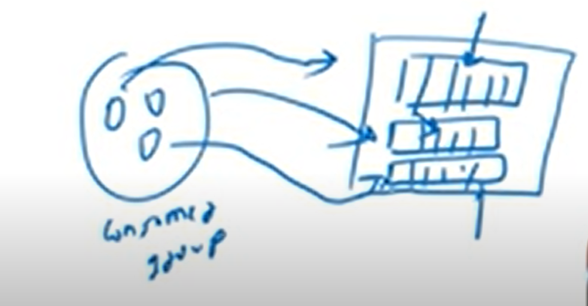

### What is `__consumer_offset` and Where It Will Be Stored?

- So, by default one topic with name `__consumer_offset` will be created.
- `__consumer_offset` is a built-in topic in Apache Kafka that keeps track of the latest offset committed for each partition of each consumer group.
- The topic is internal to the Kafka cluster and not meant to be read or written to directly by clients. Instead, the offset information is stored in the topic and updated by the Kafka broker to reflect the position of each consumer in each partition.
- The information in `__consumer_offset` is used by Kafka to maintain the reliability of the consumer groups and to ensure that messages are not lost and duplicated.
- Suppose there is a topic with 2 partitions and so many messages are there. Suppose there is a consumer. Now consumer is reading messages from one partition and all of a sudden stops reading messages, then how he will get to know while he alive once on which position he were reading messages — who will tell? So `__consumer_offset` will tell. In this `__consumer_offset` there will be entries of each consumers, that on that particular partition where you were reading last message.

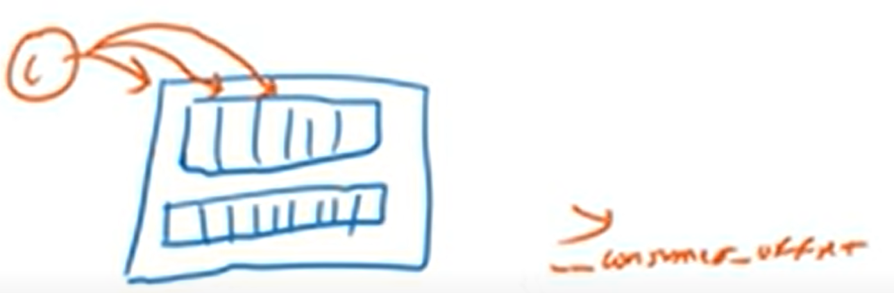

### Important Points for `__consumer_offset`

- There is a separate `__consumer_offsets` topic created for each consumer group. So, if you have 2 consumer groups containing 4 consumers each, you will have a total of 2 `__consumer_offsets` topics created.
- The `__consumer_offsets` topic is used to store the current offset of each consumer in each partition for a given consumer group. Each consumer in the group updates its own offset for the partitions it is assigned in the `__consumer_offsets` topic, and the group coordinator uses this information to manage the assignment of partitions to consumers, and to ensure that each partition is being consumed by exactly one consumer in the group.

### Let's See How Consumer from Each Consumer-Group Will Read the Message from Partitions

- Suppose we have a consumer group and there is only one consumer. There is a Topic T and there are 4 partitions p0, p1, p2 and p3. Now since there is only 1 consumer and 4 partitions, so in which manner it will consume the messages?

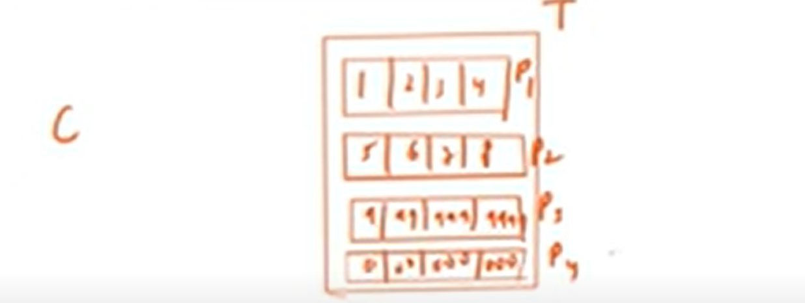

If in this consumer group there will be 3 to 4 consumers then consumer-group coordinator will come into this picture and he will get assigned each consumer to read data from which partitions. But here is only one consumer and he only reads the data from all partitions, so he will read in a round-robin fashion.

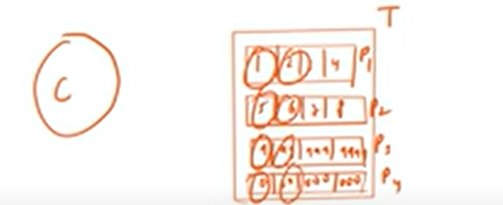

- But suppose we do have 1 consumer in this consumer group. Since each consumer is single-threaded so process will be too slow because producer is producing so many messages so 1 consumer can not handle it.

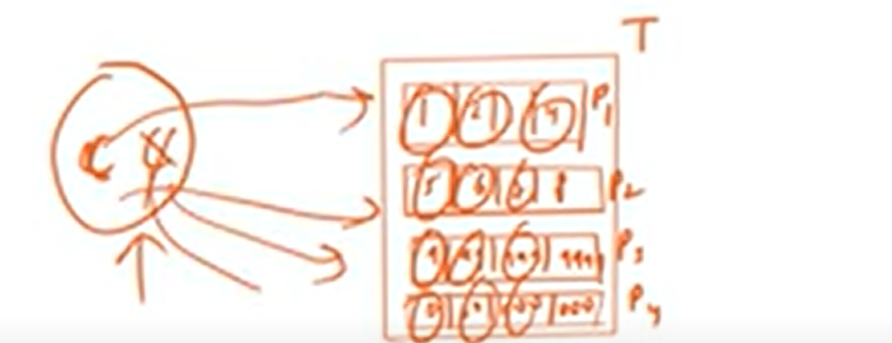

- But suppose we do have 2 consumers in this consumer group and consumer-group coordinator will get assigned: first consumer will handle first 2 partitions and second consumer will handle last 2 partitions.


- When a consumer joins a consumer-group, it sends a join request to the group coordinator.
- The group coordinator determines which partitions the consumer should be assigned based on the number of consumers in the group and the current assignments of partitions to consumers.
- The group coordinator then sends a new assignment of partitions to the consumers, which includes the set of partitions that the consumer is responsible for consuming.
- The consumer starts consuming data from the assigned partitions.
- It is important to note that consumers in a consumer group are always assigned partitions in a **"sticky"** fashion, meaning that a consumer will continue to be assigned the same partitions as long as it remains in the group. This allows consumers to maintain their position in the topic and continue processing where they left off, even after a rebalance.

- Suppose we have a consumer group `a` and consumer group `b`. In consumer group `a` there are 2 consumers `a1` and `a2`; in consumer group `b` there are 2 consumers `b1` and `b2`. We have a topic with 4 partitions. Then how consumer group coordinator is going to assign these partitions among them?
  - Partition 1 will go to a1, partition 2 will go to a2, partition 3 will go to b1 and partition 4 will go to b2. It will happen in a round-robin fashion.

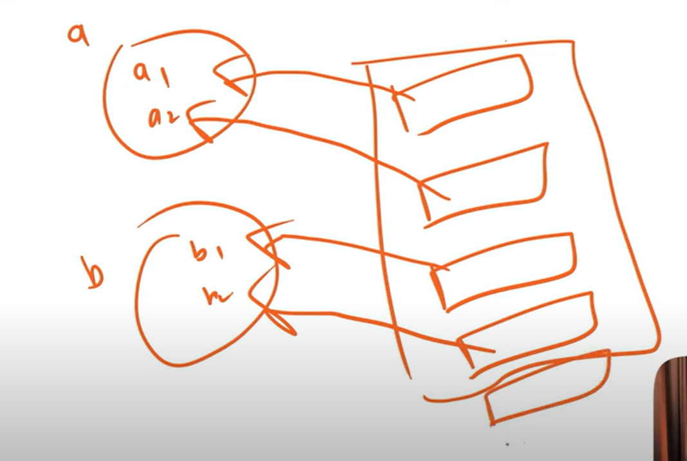

Suppose if we have 2 more partitions then partition 5 will go to a1 and partition 6 will go to a2.

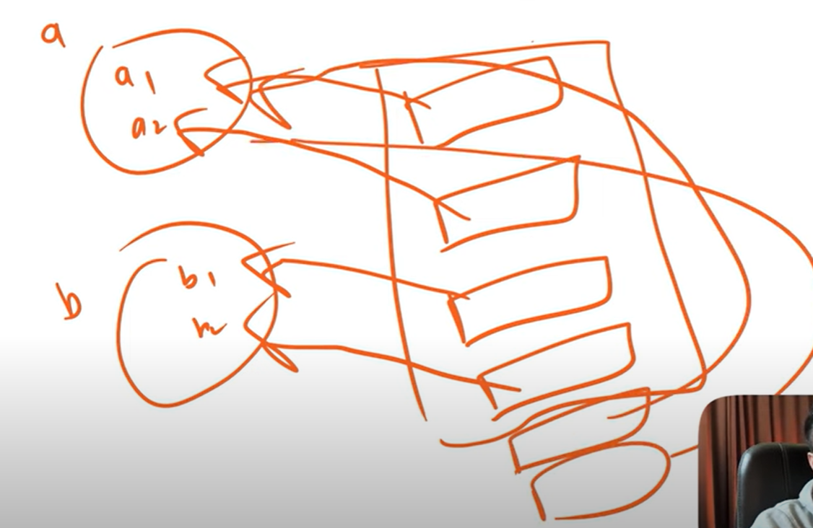

---

## Consumer Offset and Consumer Group Demonstration

### Step-1: Start Zookeeper

```
C:\kafka_2.13-3.9.1\bin\windows>zookeeper-server-start.bat ..\..\config\zookeeper.properties
```

### Step-2: Start Kafka-server / Kafka-broker

```
C:\kafka_2.13-3.9.1\bin\windows>kafka-server-start.bat ..\..\config\server.properties
```

### Step-3: View the List of Topics

```
C:\kafka_2.13-3.9.1\bin\windows>kafka-topics.bat --bootstrap-server=localhost:9092 --list
```

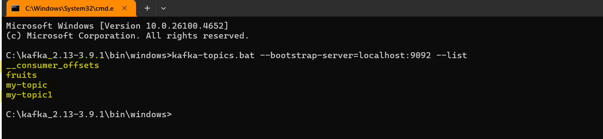

- We can see here we have a `__consumer_offset` topic. Same like this we can see consumer group also.

### Step-4: View the Consumer Groups

```
C:\kafka_2.13-3.9.1\bin\windows>kafka-consumer-groups.bat --bootstrap-server localhost:9092 --list
```

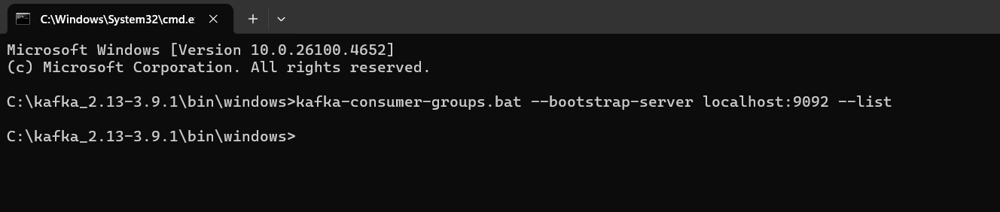

- We can see as of now there are no consumer groups.
- Let's start one consumer `kafka-console-consumer.bat`

```
C:\kafka_2.13-3.9.1\bin\windows>kafka-console-consumer.bat --bootstrap-server localhost:9092 --topic my-topic --from-beginning
```

- It is consuming from `my-topic`.
- Now let's run the consumer group command once again (`C:\kafka_2.13-3.9.1\bin\windows>kafka-consumer-groups.bat --bootstrap-server localhost:9092 --list`)
- Earlier we have seen whenever we run `kafka-console-consumer` then by default one group id gets assigned to him.

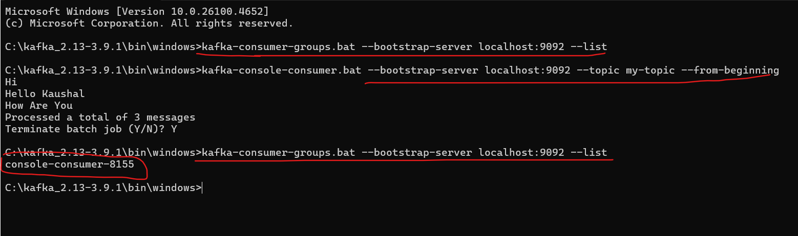

- So, one consumer group got created `console-consumer-8155`.
- Now let's re-run one more time `kafka-console-consumer.bat`.
- Now let's run the consumer group command once again. Now we can see we have 2 consumer groups:
  - `console-consumer-48147`
  - `console-consumer-59930`

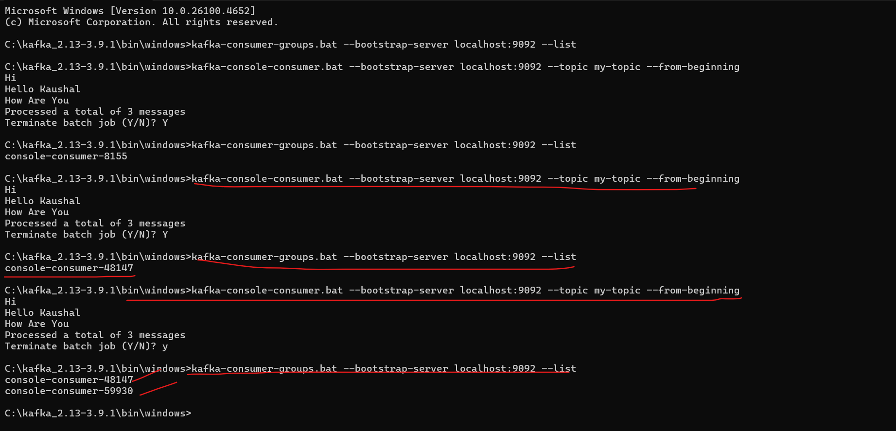

- We have run 2 times `kafka-console-consumer` and both the times different-different consumer group got created.

### Step-5: Run the Producer

```
C:\kafka_2.13-3.9.1\bin\windows>kafka-console-producer.bat --broker-list localhost:9092 --topic my-topic
```

### Step-6: Run the Consumer

- Now we will run 2 Kafka consumers and from these 2 consumer groups I will assign any one group to both the consumers. Till now we were simply running the Kafka consumers, then group coordinator automatically assigned group id to that consumer, but now I will assign the group id to the consumers.
- Let's start 2 consumers within the same consumer group id.

```
consumer 1 - C:\kafka_2.13-3.9.1\bin\windows> kafka-console-consumer.bat --bootstrap-server localhost:9092 --topic my-topic --group console-consumer-48147
consumer 2 - C:\kafka_2.13-3.9.1\bin\windows> kafka-console-consumer.bat --bootstrap-server localhost:9092 --topic my-topic --group console-consumer-48147
```

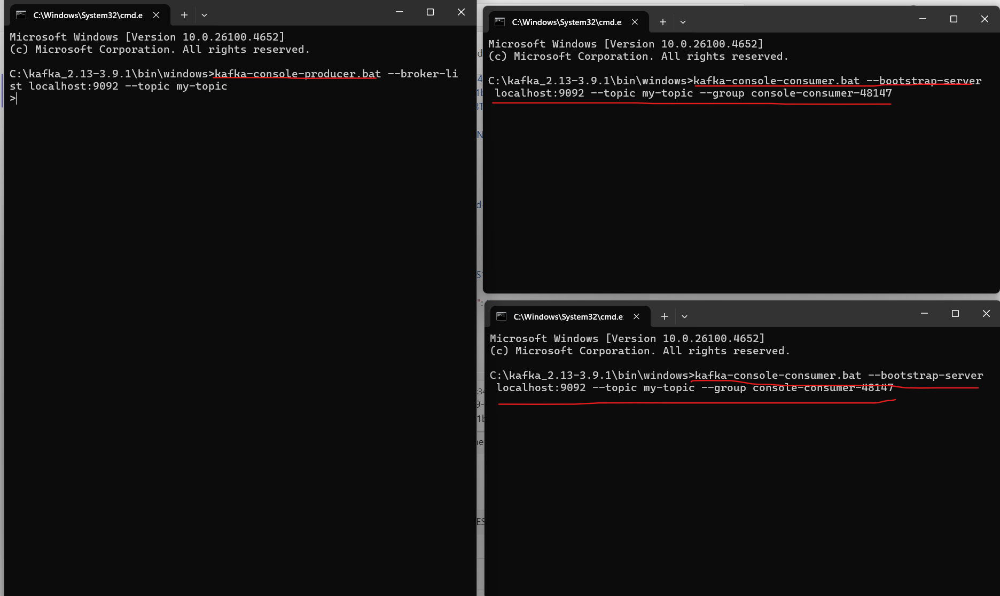

- Before producing data to `my-topic` let's see the details about the Topic `my-topic`, like how many partitions are there.
- Below command to describe `my-topic`:

```
C:\kafka_2.13-3.9.1\bin\windows> kafka-topics.bat --describe --topic my-topic --bootstrap-server localhost:9092
```

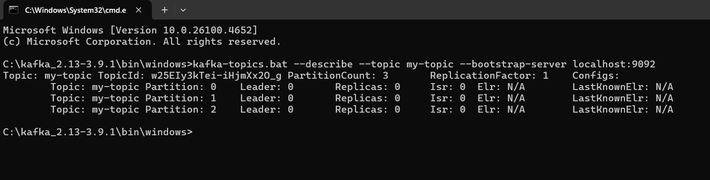

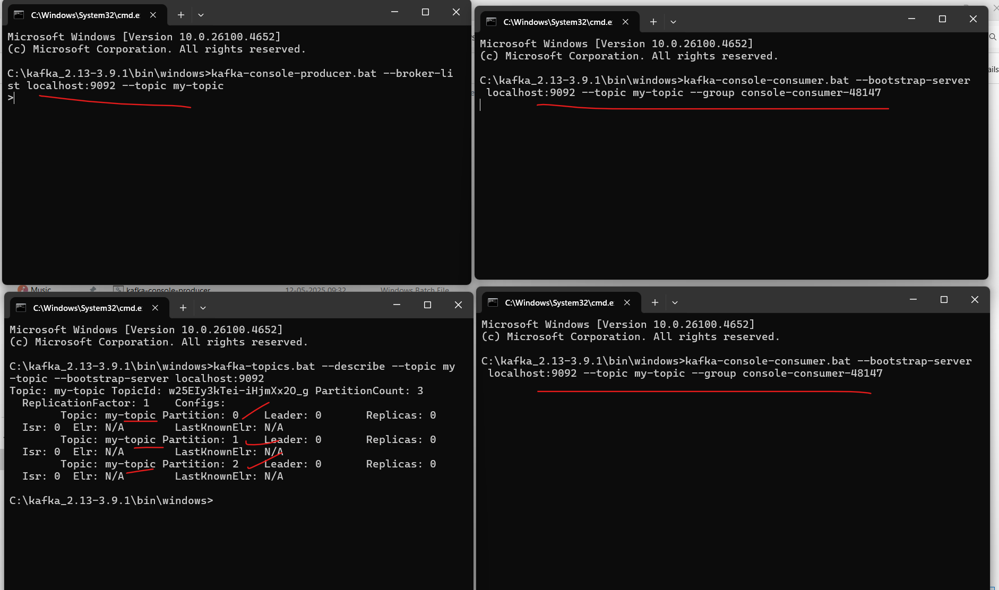

- There are total of 3 partitions.
- Now we have to describe the group id nicely.
- Since there are 3 partitions so let's create 3 consumers.
- So, now 1 producer and 3 consumers.

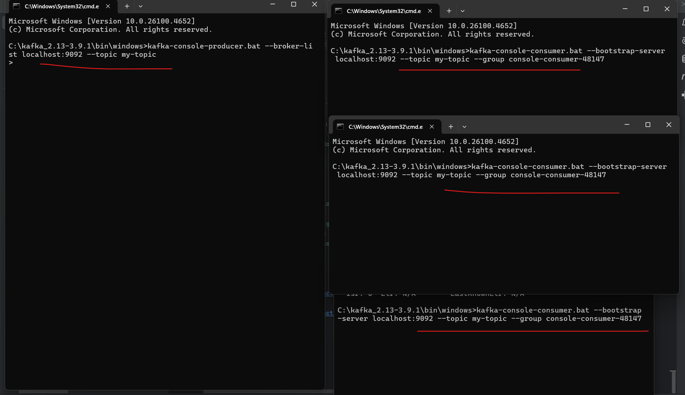

- So whatever all messages we are producing from producer, it is coming to the same consumer: `consumer-2`.

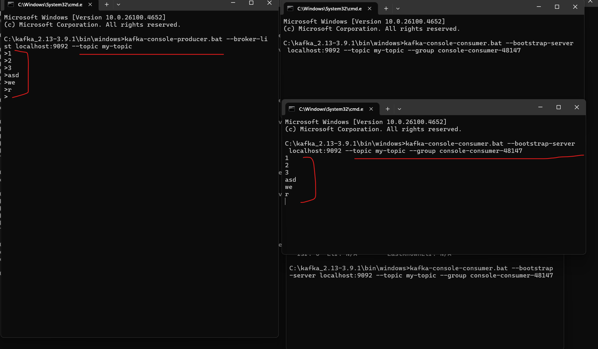

- So, let's stop `consumer-2` and let's start producing.
- Now all the messages from producer is coming to `consumer-3`.

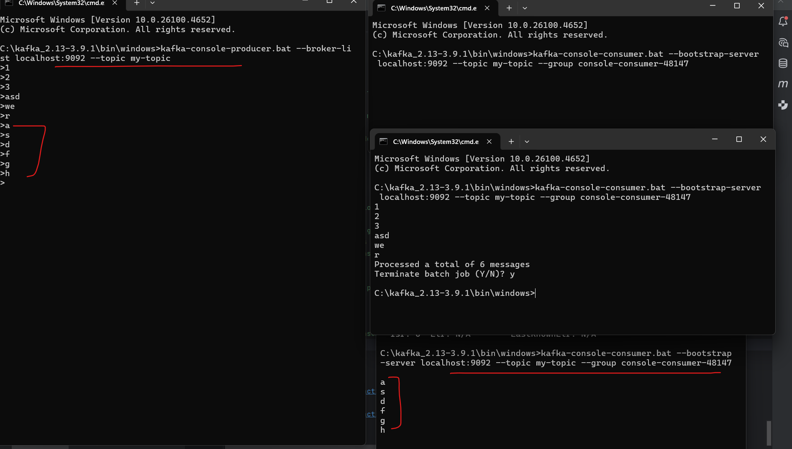

- So, let's stop `consumer-3` and let's start producing.
- Now all the messages from producer is coming to `consumer-1`.

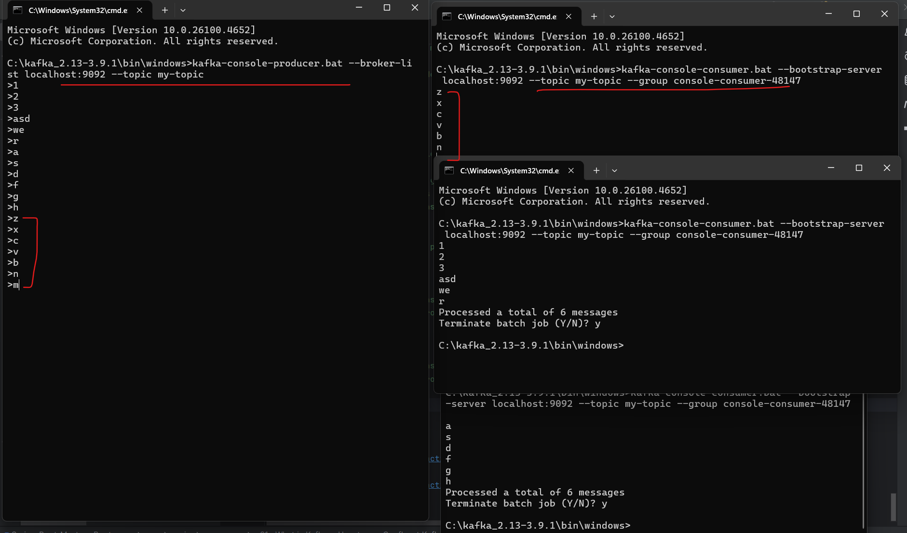

> \*\*\* Now what is happening here is our group coordinator is assigning at one time only one consumer the whole topic data, doesn't matter how many partitions are there for a topic.
> \*\*\* Let's stop all producer and consumers.

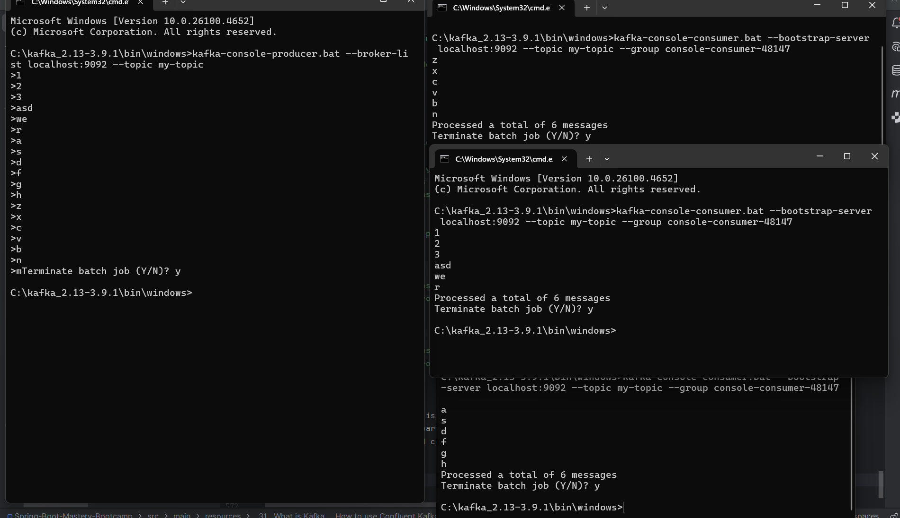

---

## Another Demonstration for a Foods Topic with Key Producing

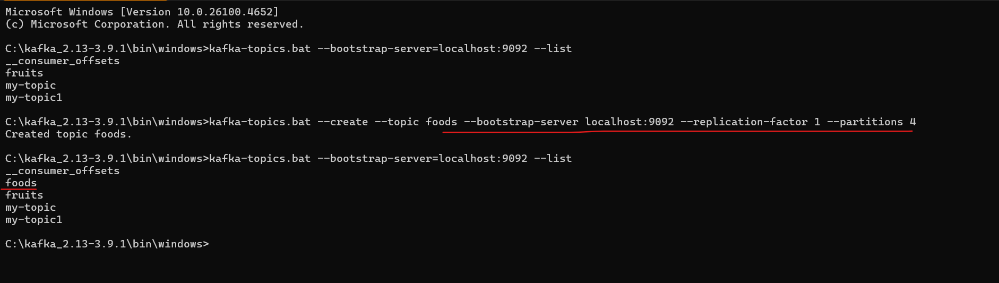

- We have created a `foods` topic.
- Let's see the foods topic description first.

```
C:\kafka_2.13-3.9.1\bin\windows> kafka-topics.bat --describe --topic foods --bootstrap-server localhost:9092
```

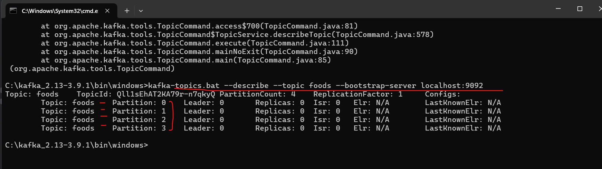

- In foods topic we have 4 partitions.

### Step-1: Start producer on topic - foods
### Step-2: Start consumer on topic - foods

- Now the message which I will send in topic foods I will send with key-separator.
- This time I will run only 2 consumers.

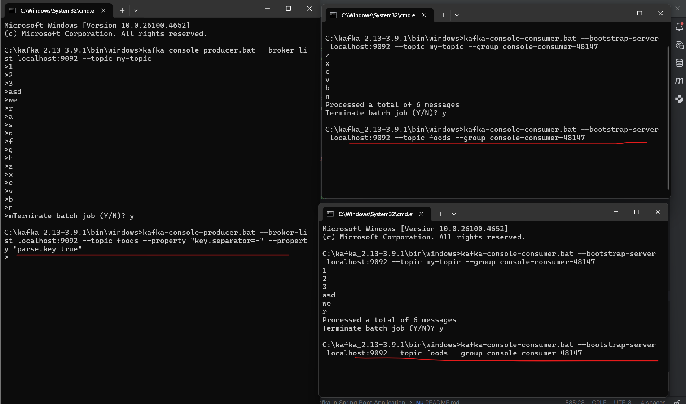

- Here we have given key-separator as `"-"`.
- So before `-` will be key and after `-` will be message — `hello` is key and `apple` is message as an example.

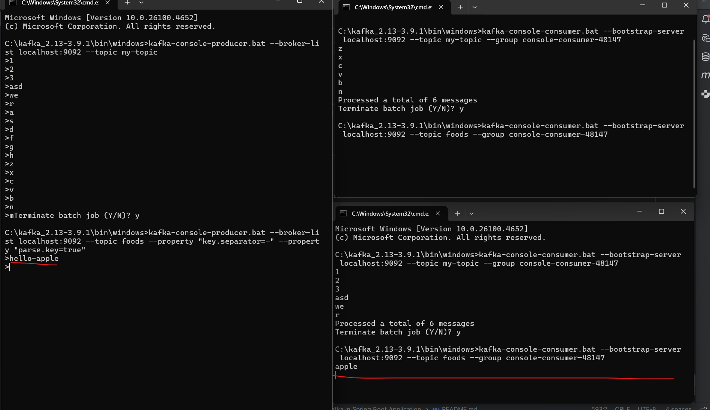
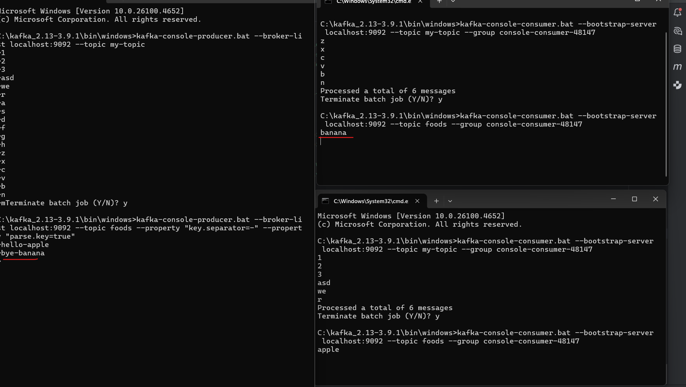

- We can see here Key: `hello` is consumed with `consumer-2`.
- We can see here Key: `bye` is consumed with `consumer-1`.

- Let's create 2 more keys because we have 4 partitions.
- So what will happen — corresponding to 1 key, 1 partition will get assigned.
- If we are not using key while producing then it will go in a round robin fashion like first in P0, then P1, then P2 then P3... Again 5th data in P0, 6th in P1, 7th in P2 and then 8th in P3...
- Now corresponding to 1 key one partition will get assigned.

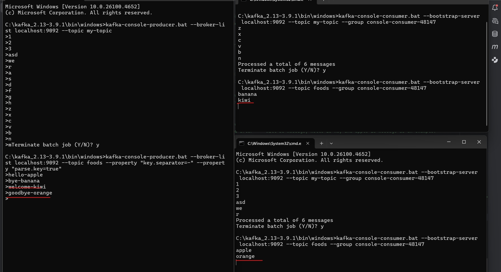

- `welcome` key data also going in partition 1.
- `goodbye` key data is going to partition 2.
- The partition which store data of `hello` key is going to consumer 2, and the partition which store data of `bye` key is going to consumer 1.
- Here consumer coordinator is assigning 2 partitions to consumer 1 and 2 partitions to consumer 2.
- So, if you write anything with key `hello` it will always go to consumer 2.

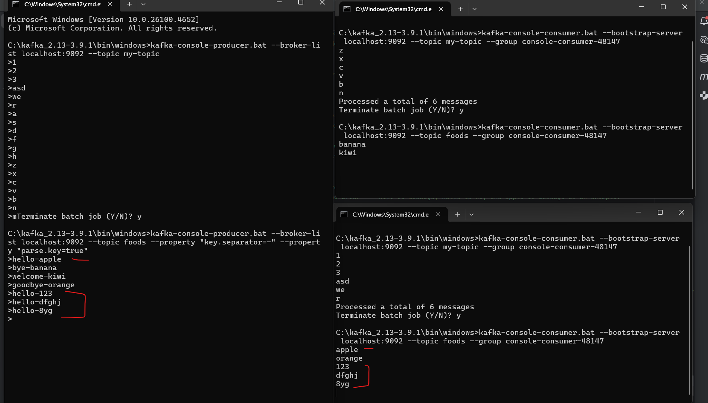

- Same like if you write anything with key `welcome` it will go to consumer 1.

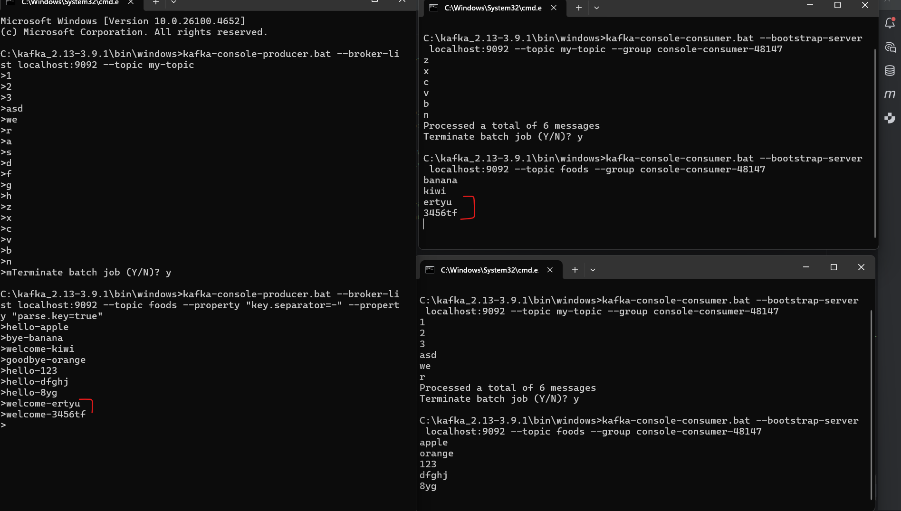

> \*\* So what the coordinator has done here is 2 partitions he has assigned to consumer 1 and 2 partitions he has assigned to consumer 2.

---

## Segments - Commit Logs - Retention Policy

### Segment

- Suppose we have a Producer and he has produced some messages. So, the question is in an actual way where will this messages get stored?
- We know this message will go inside a Topic.
- Suppose we have a Topic and there are 3 partitions into it.

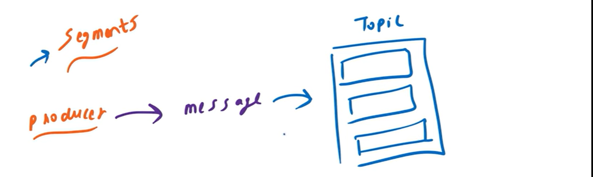

- In each partition, messages will be appended.
- A particular set of messages we called **Segments**.

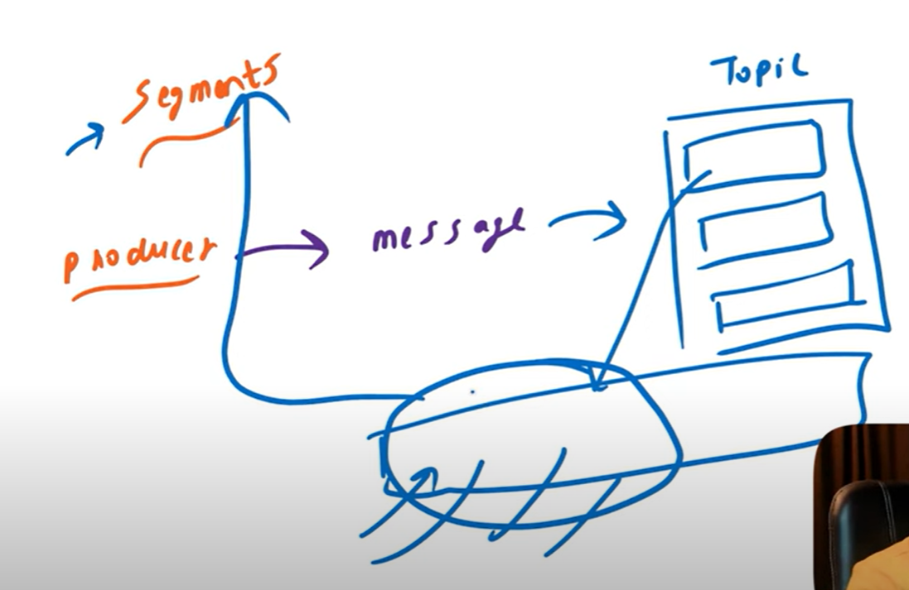

- We have a Topic — inside a Topic we do have partitions.
- Inside a Partitions we can see there are so many messages.
- One set/parts of those messages we can say as a segments.
- The size of a Segment we can define. However much we define, that many messages only will come into our segments.

### Commit Logs

- In an actual way the message will be stored inside a File System.
- Where we have installed Kafka, inside config folder there will be a file `server.properties`. In this file you can see the directory of commit logs where the actual messages present. You will see many `.log` files in Kafka logs — this is called commit logs. So actual data what Kafka producer produces will be stored here. Data is stored in `C:\tmp\kafka-logs`.

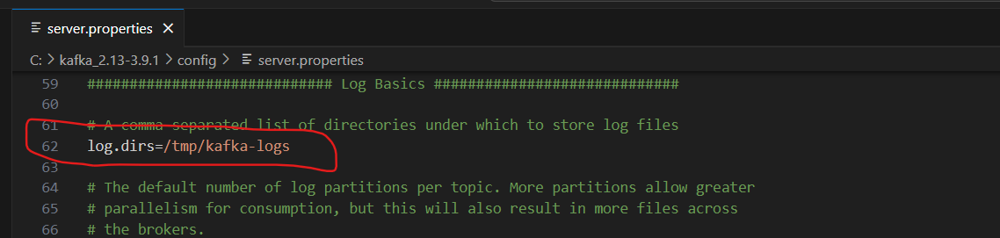
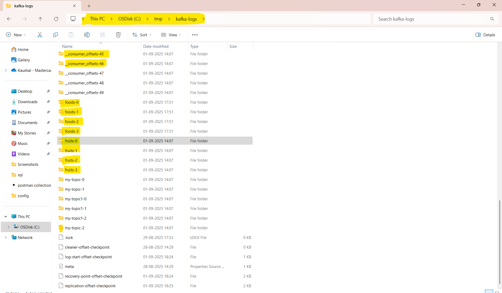


- We can see for `foods` there are 4 folders, because food topic we are having and there are 4 partitions of that topic.
- Now let's go in one partition and see the log file of it.
- All data will get stored here only.


- Segment size we can define — when this file size gets increased with the segment size, then a new file will be created.

### Commit Logs (Retention Policy)

- Now the size will keep increasing. Now the question is till what time we have to keep that data — we call this as a **Retention Policy**.
- **2 types of retention policy:**
  - **Size based policy** — either after a specific size we can delete that file. If we have given 1GB of data then once more than 1GB data, oldest data will get deleted.
  - **Time based policy** — delete the older data from 7 days.
- Log cleaner process runs in background and sees which messages retention time got over, it will clean up those messages.
- These log files are in encoded format.
- Producer actually encodes and then stores, and consumers read data and then decode.
- By default the retention hour is **168 hrs** which is approximately 7 days.


---

## 3-Broker Cluster Set-Up

**Kafka Cluster** - Group of Kafka Brokers/Servers.

- To start Kafka Broker go to bin, run the `kafka-server-start.bat` batch file and provide it a `server.properties` file.
- Which means `server.properties` is a crucial part to start a Kafka broker.
- In this file `server.properties` there are properties of a Kafka broker:
  - `broker.id=0`, every broker having a unique id.
  - port - 9092
  - log directory - `log.dirs=/tmp/kafka-logs`


- `temp/kafka-logs` where our commit logs get stored.
- Earlier we were going to `bin/windows`, then run zookeeper and then Kafka broker.

### Demonstration

- I want to create a Kafka cluster with 3 Kafka-brokers.
- Go to config folder, copy `server.properties` and paste 2 times. Change file name as `server-1.properties` & `server-2.properties`.


- We can see all 3 brokers detail (broker-id, broker-port, broker-logfile-name).


- Now run a zookeeper and 3 Kafka brokers.
- Here we do have 3 log files corresponding of all 3 Kafka brokers.


- In all 3 `server.properties` only one zookeeper is there, so these all 3 brokers communicated with each other because they all are parts of the same zookeeper. So, our cluster has been created.

- Let's create a Topic with replication factor 3 and with 3 partitions:

```
kafka-topics.bat --create --topic gadgets --bootstrap-server localhost:9092 --replication-factor 3 --partitions 3
```


- A Topic with 3 replication factor means there will be 3 copies of topic.
- Suppose Producer sending a message to the topic — actually message will go inside a partition.
- So first of all message will go to any one of the brokers. Suppose it went to first broker, so once it will go to first broker then it will replicate to the second broker and third broker for fault tolerance.
- When first broker will go down then consumer will start picking data from second broker, which means **replication factor gives us fault tolerance**.

### Important

Suppose Messages is coming from Producer and we have a Topic and in that topic we have 3 partitions.
In our Kafka cluster there are 3 Brokers B1, B2 and B3, which means we ran 3 Kafka server instances.

Now the Leader is decided — which means first of all where messages will go, which will happen on the basis of Partition.

**On Partition Level Leader will be decided.**

Suppose there is 3 copies B1, B2 and B3.


It may happen:
- Broker 1 will be the Leader of Partition 3 of server 1.
- Broker 2 will be the Leader of Partition 1 of replica server 2.
- Broker 1 will be the Leader of Partition 2 of replica server 2.


Which means:
- If Messages will go to 3rd Partition then first of all data will go to the Broker B1 because he is the leader, and messages will get replicated to Broker B2 and Broker B3.
- If Messages will go to 2nd Partition then first of all data will go to the Broker B3 because B3 is the leader of Partition 2, and messages will get replicated to Broker B1 and Broker B2.
- If Messages will go to 1st Partition then first of all data will go to the Broker B2 because B2 is the leader of Partition 1, and messages will get replicated to Broker B1 and Broker B3.

-- Let's create a topic `my-gadgets` with replication factor 3 because we do have 3 Brokers.

> \*\* 

-- Let's start producer with 3 brokers:

```
kafka-console-producer.bat --bootstrap-server localhost:9092,localhost:9093,localhost:9094 --topic gadgets
```

-- Let's start consumer with 3 brokers:

```
kafka-console-consumer.bat --bootstrap-server localhost:9092,localhost:9093,localhost:9094 --topic gadgets --from-beginning
```


> \*\* Now go to `temp` — we have 3 kafka logs folder because we have 3 Kafka brokers.
> \*\* In first one we can see 3 gadgets folders because we have 3 partitions so 3 folders created.


> \*\* Since it is replicating in all 3 brokers so it is created in all 3 brokers.


---

## ISR - (In-Sync Replica)

- We have created 3 `server.properties` files specific to 3 Kafka-brokers.
- We have given unique broker id like broker id - 0, broker id - 1, broker id - 3.
- Now we are having 3 brokers with id 0, 1 and 3.

- Let's start zookeeper first:

```
C:\kafka_2.13-3.9.1\bin\windows> zookeeper-server-start.bat ..\..\config\zookeeper.properties
```

- Let's run all 3 brokers with id 0, 1 and 3.
- Earlier we have created a topic `gadgets` with 3 replication factor and 3 partitions, and we saw when any messages comes then how it gets distributed. Replication will happen on the topic level. Suppose we have 3 brokers then 1 broker will be leader of 1 partition, 2nd broker will be a leader of another different partition, and 3rd broker will be a leader of another different partition.
- For an example, here we have a topic `gadgets` where we have 3 partitions. So in these 3 partitions, different-different all 3 brokers will be the leader and rest two will be the follower.

- Let's describe the gadgets topic:

```
kafka-topics.bat --describe --topic gadgets --bootstrap-server localhost:9092, localhost:9093, localhost:9094
```


- If you give one server detail also, it will give same results because all 3 brokers are connected.


- We have a topic `gadgets`, where we do have 3 partitions: partitions-0, partitions-1 and partitions-2.
  - partitions-0 leader is broker with broker id - 1
  - partitions-1 leader is broker with broker id - 0
  - partitions-2 leader is broker with broker id - 3

- Every partition we have created 3 replicas because we have created partitions with 3 replicas. So every partition will have 3 replicas which will be in different-different brokers in which 1 will be the leader.


- We can see there are 3 replicas but first is the leader. So here we can see partition-0 is having 3 replicas and where they are located — they are located on broker 3, broker 0 and broker 1. So 1st one is the leader and rest 2 are the followers.
- Similarly partition-1 also replicated 3 times and they are located on broker 0, broker 3 and broker 1 where broker-0 is the leader and broker-3 and broker-1 is the follower. And similar for partition - 3. **ISR** means **In-Sync-Replica**. In sync replica means all data are in sync.

- Brokers with different broker id is the Leader of all 3 different partitions.

- Now let's make one Broker-3 down and then describe the topic-gadgets and see the result. Let's stop one broker.


- We can see different result because one replica went away.
- Now we are having the replicas and leaders got changed, but In-sync replica is only 0 and 1. Broker with broker id - 3 is not in sync because it has closed. So, this is the complete picture of replication factors in Kafka.

---

## ISR Explained (Detailed)

In Apache Kafka, an **In-Sync Replica (ISR)** is a follower replica of a partition that is fully caught up with the leader replica, meaning it has the most up-to-date copy of the partition's data.

ISRs are crucial for fault tolerance because only replicas within the ISR are eligible to become the new leader if the current leader fails, ensuring no committed data is lost. The set of ISRs is dynamically maintained by the leader and is vital for guaranteeing that messages are not lost in case of a broker failure.

### How ISRs Work

1. **Leader and Followers:**
   For each partition, one broker acts as the leader, which handles all write and read requests. Other brokers act as followers and replicate data from the leader.
2. **Replication Process:**
   Followers continuously fetch new messages from the leader to stay synchronized.
3. **ISR Membership:**
   A follower is considered an ISR if it has recently fetched messages from the leader and is within a configurable time threshold (`replica.lag.time.max.ms`). If a follower falls too far behind the leader, it is removed from the ISR.
4. **Leader Election:**
   When a leader fails, the control plane (typically Apache ZooKeeper) holds an election, and only brokers within the current ISR are eligible to be elected as the new leader.

### Why ISRs Are Important

- **Fault Tolerance:** By only promoting in-sync replicas, Kafka prevents data loss. If a leader fails, another in-sync replica can take over with all the latest data, ensuring the partition remains available and no messages are lost.
- **Data Consistency:** ISRs ensure that when a write is committed, it has been acknowledged by the leader and all the replicas in the ISR, guaranteeing that the data is replicated across multiple brokers.

### Configuration and Key Parameters

- **`min.insync.replicas`:**
  This is a crucial setting for producers to control the level of fault tolerance. A producer only considers a write successful if it receives an acknowledgment from the leader and at least `min.insync.replicas` (which includes the leader) have acknowledged the write. For example, if you have `min.insync.replicas=2` and a replication factor of 3, then at least 2 brokers must acknowledge the write for it to be considered committed.

- **`replica.lag.time.max.ms`:**
  This parameter defines the maximum amount of time a follower can lag behind the leader before being considered out of sync and removed from the ISR.

---

Now we have done with the internal details of Kafka. We have done with the Local Setup in our System of Kafka. Now we are going to use managed Kafka which will be on AWS. So, we will see how we can integrate Kafka with Spring Boot.

---

## Integration with Spring Boot

*(To be added.)*

---

## References

- https://newrelic.com/blog/best-practices/effective-strategies-kafka-topic-partitioning
- https://newrelic.com/blog/best-practices/kafka-best-practices

